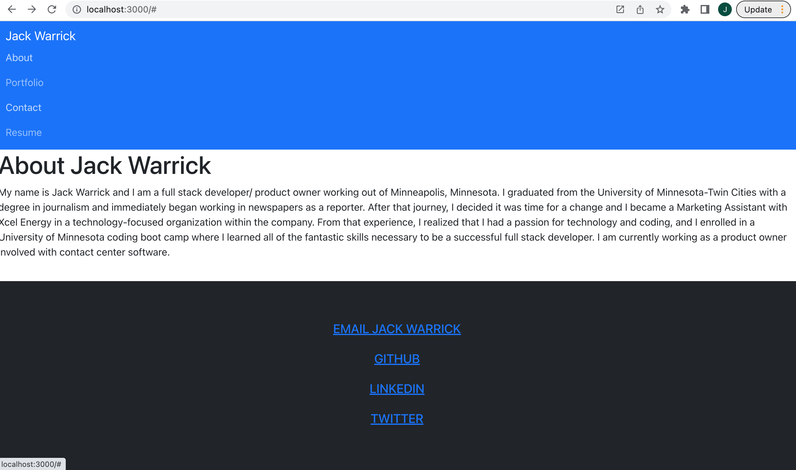

# React Portfolio Challenge 

## Table of Contents

* [Description](#description)

* [Contributing](#contributing)

* [License](#license)

* [Questions](#questions)

* [Media](#media)

## Description

This application is a React portfolio for myself, Jack Warrick. It is a single page application with a header, nav, content, and a footer. The four sections - about, portfolio, resume, and contact - can be clicked on and the page content loads without refreshing the page. The title is also highlighted when you are on that section. The about me is the default page when you load the application. The about me section has info about me. The portfolio section has my projects' titles, descriptions, and links to the deployed apps and the repositories. The contact section has my email and number. And the Resume section says I've done some cool stuff. The footer has links to send me an email, my Twitter, my GitHub profile, and my LinkedIn account.

## Contributing

Jack Warrick

## License

This application is covered under the MIT License.

## Questions

For more information, please reference my GitHub profile [here](https://github.com/JackWarrick), or reach out to my email: j.d.warrick@comcast.net.

## Media

**Link to deployed application:**

[Link to Deployed Application](https://jackwarrick.github.io/React-Portfolio-Challenge/#)

-----

**Screenshot:**

